# Appointment Booking System
This is a frontend app of an appointment booking system designed for patients and doctors. Doctors set their availability, and patients can book appointments based on this availability. The system is currently under development, and it is deployed on Vercel for testing purposes. However, it is recommended to run it locally for full development experience.


This is a [Next.js](https://nextjs.org) project bootstrapped with [`create-next-app`](https://nextjs.org/docs/app/api-reference/cli/create-next-app).

## Getting Started

First, run the development server:

```bash
npm run dev
# or
yarn dev
# or
pnpm dev
# or
bun dev
```

Open [http://localhost:3000](http://localhost:3000) with your browser to see the result.

You can start editing the page by modifying `app/page.tsx`. The page auto-updates as you edit the file.

This project uses [`next/font`](https://nextjs.org/docs/app/building-your-application/optimizing/fonts) to automatically optimize and load [Geist](https://vercel.com/font), a new font family for Vercel.

## Learn More

To learn more about Next.js, take a look at the following resources:

- [Next.js Documentation](https://nextjs.org/docs) - learn about Next.js features and API.
- [Learn Next.js](https://nextjs.org/learn) - an interactive Next.js tutorial.

You can check out [the Next.js GitHub repository](https://github.com/vercel/next.js) - your feedback and contributions are welcome!

## Adding ShadCN Components
To add ShadCN components to your project, use the following command:

```
npx shadcn@latest add [component]
```
Replace [component] with the desired component name. This will automatically add the component and all necessary dependencies to your project.

## TypeScript Support
The application is built with TypeScript, providing proper type safety across the codebase. Make sure to follow TypeScript conventions while working with the code.

## Features
Doctor Availability Management: Doctors can set their availability for appointments.
Patient Appointment Booking: Patients can book appointments based on the available time slots provided by doctors.

## Screenshots
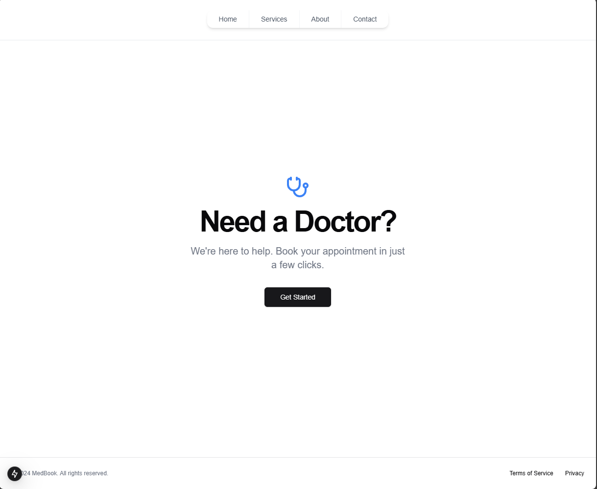
> landing page of the website

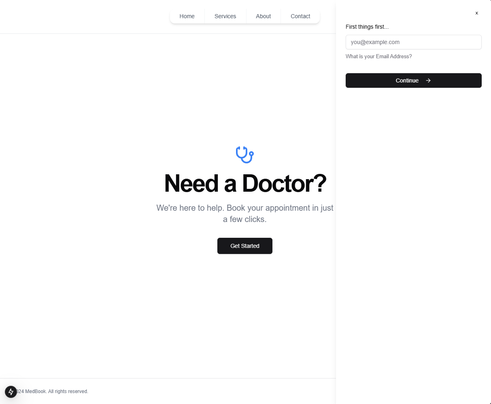
> The app asks for an email then checks if it exists or not

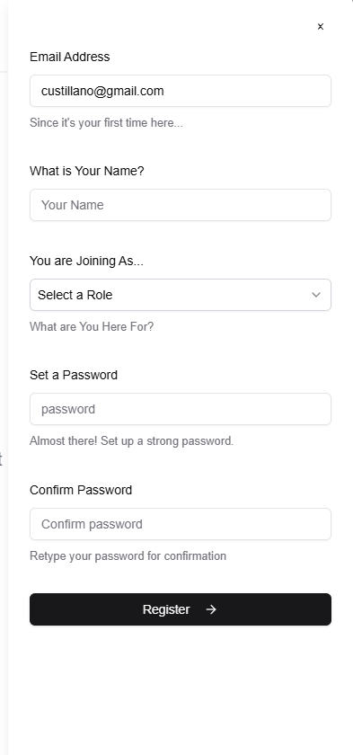

> Prompts registration for new users

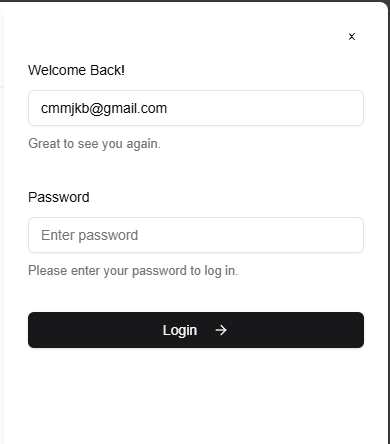
> Quick login for existing users

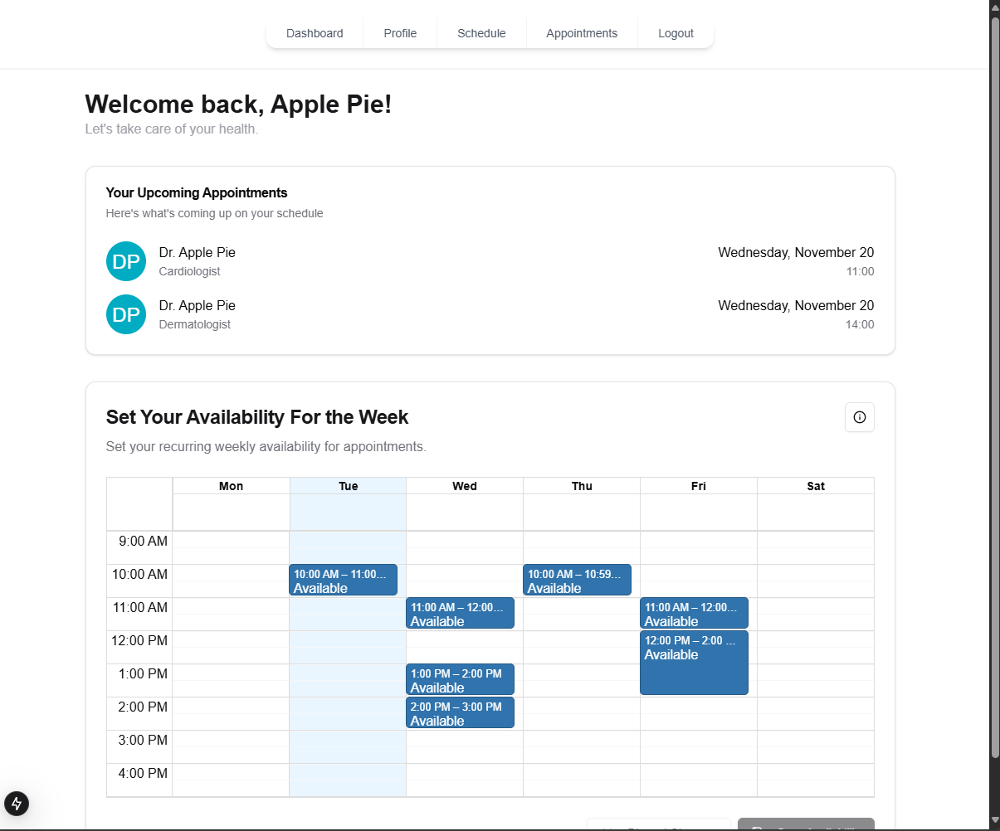
> Dashboard for doctors, contains upcoming appointments and week availability scheduler

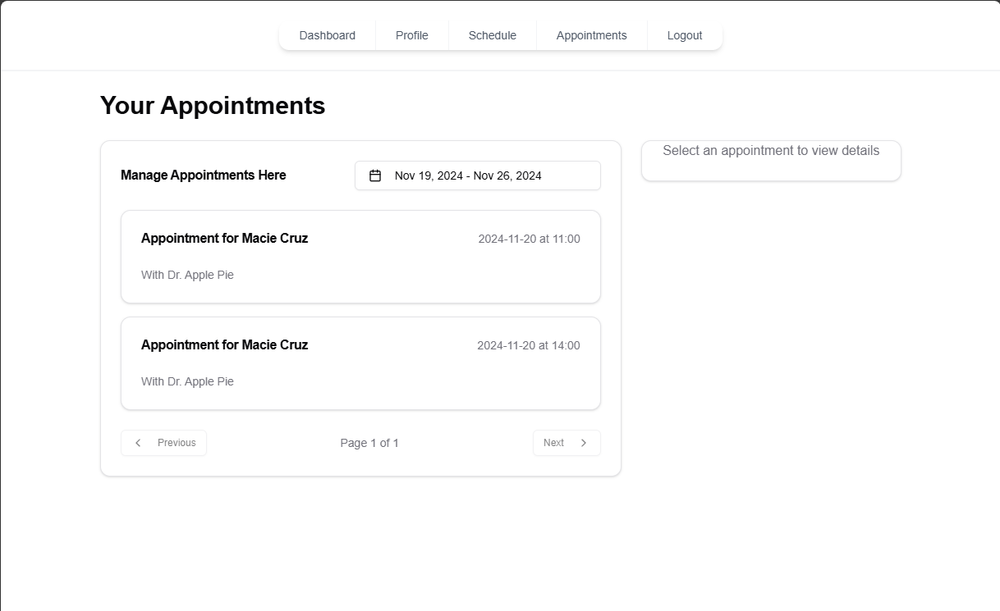
> Appointments management page, quickly edit or delete appointments

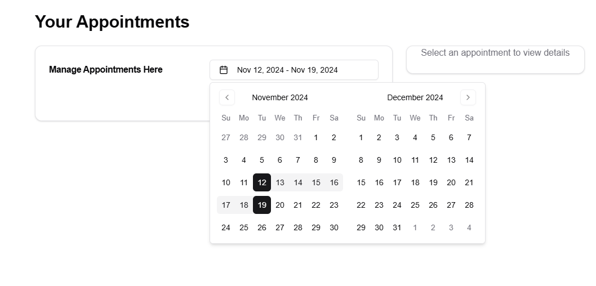
> Appointments can be looked up with a date range. Paginated for optimisation

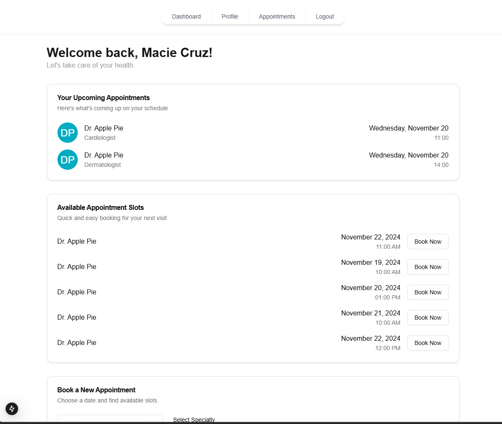
> Dashboard for patients

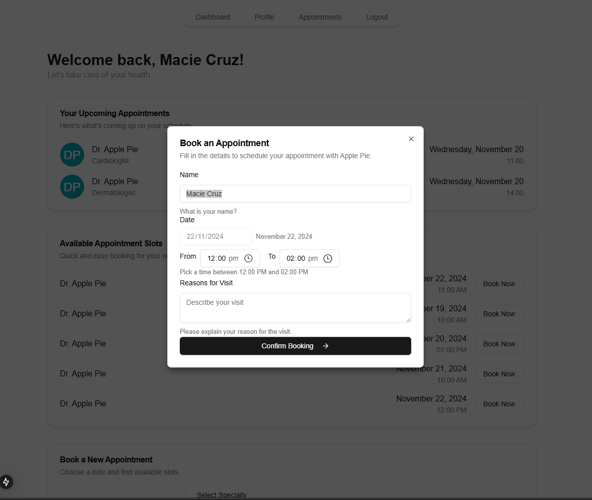
> Quick booking feature, listing available slots of doctors

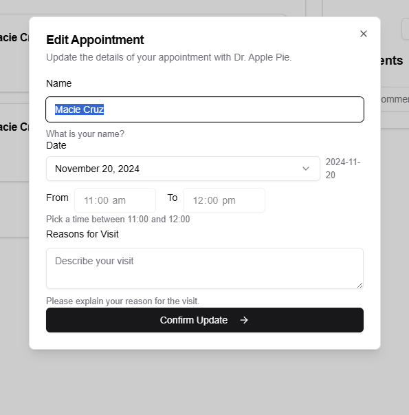
> Edit booking

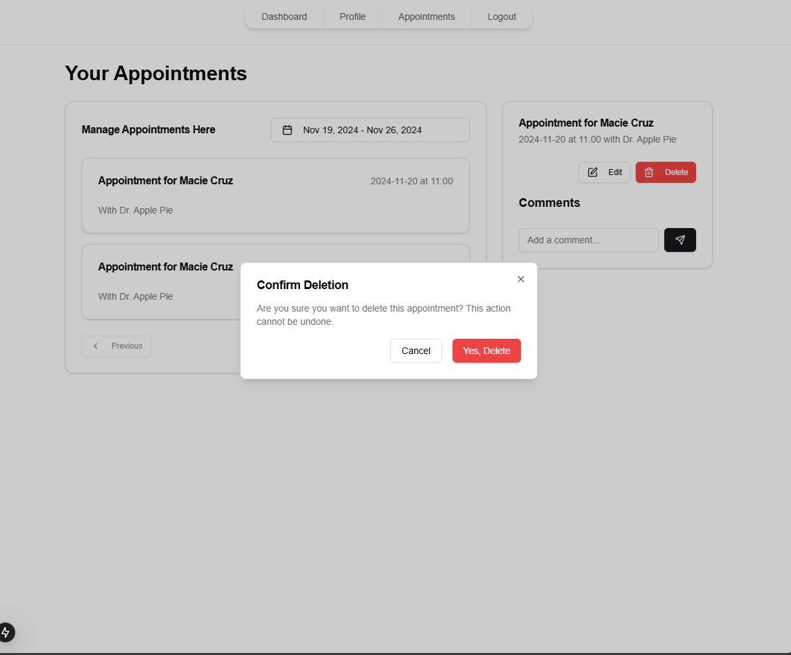
> Delete booking
